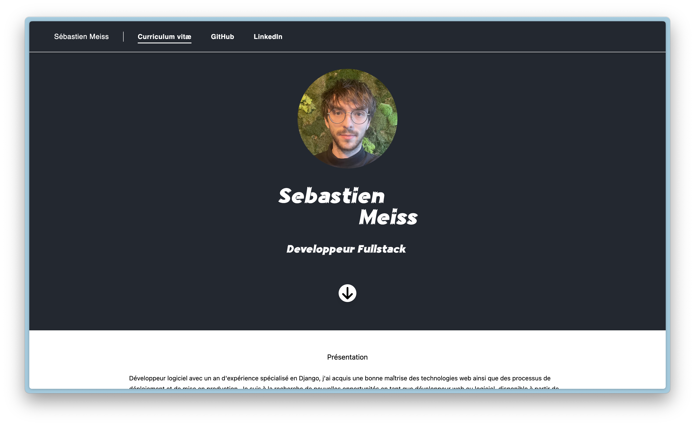

# My portfolio


## Environment variables
| NAME                 | DEFAULT VALUE    | DESCRIPTION                                     |
| -------------------- | ---------------- | ----------------------------------------------- |
| SECRET_KEY           | No default value | Django's secret key                             |
| ALLOWED_HOSTS        | No default value | host/domain names that the Django application is allowed to serve |
| DEBUG                | False            | Please set up this value to False in production |
| SECURE_SSL_REDIRECT  | True             | Please set up this value to True in production  |

## Docker
```sh
git clone PROJECT
cd portfolio

docker build -t portfolio .
docker run --detach --name portfolio-container --env-file=SOME_FILE -p PORT:8000 portfolio 
```

## Continuous integration
<p>Actually using Woodpecker CI</p>
<p>There is a .woodpecker folder in project root.</p>

## Development commands
```sh
cd portfolio
uv sync
uv run python manage.py runserver
```

Considering there is tailwindcss binary in project root
```sh
./tailwindcss -i main/static/css/input.css -o main/static/css/style.css -w
```